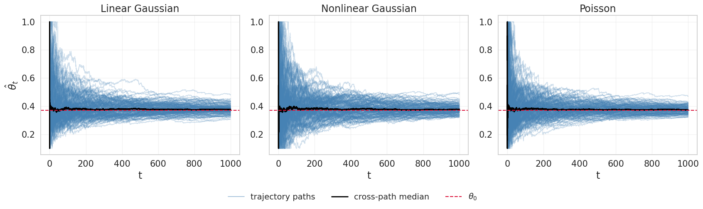
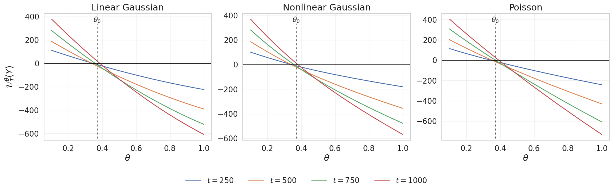

# likelihood_filtering

**Estimate a hidden system's mean-reversion rate from noisy measurements.** This
Python package studies a process whose state changes continuously but cannot be
observed directly. It filters the observations and estimates the unknown parameter
as data arrive.

The main examples share a one-dimensional Ornstein–Uhlenbeck (OU) signal:

$$
dX_t = -\theta X_t\,dt + 0.15\,dW_t.
$$

Here, $X_t$ is the **hidden signal** and $\theta$ controls how quickly it returns
toward zero. The estimator sees only one of these observation streams, not $X_t$:

| Observation model | What is recorded |
| --- | --- |
| Linear Gaussian | Noisy continuous measurements proportional to $X_t$ |
| Nonlinear Gaussian | Noisy continuous measurements through a sigmoid sensor |
| Poisson | Event counts whose rate depends on $X_t$ |

**Input:** Gaussian observation increments or Poisson counts over time. **Output:**
a running estimate $\hat\theta_t$ of the mean-reversion rate, with score and
information diagnostics. The command-line experiments generate simulated data;
the Python filtering API also accepts supplied observation increments.



*Thesis numerical experiment:* Each panel shows 150 independently simulated
observation records for the same hidden OU model, with true parameter
$\theta_0=0.37$ and horizon $T=1000$. Pale blue lines are online estimates, the
black line is their median, and the red dashed line is the true value. The
estimates concentrate near $\theta_0$ as more observations arrive. These are
simulation results, reproduced from the numerical experiments chapter of the
author's PhD thesis.

## How the estimate is computed

1. For each candidate $\theta$ on a grid, run an **augmented ensemble Kalman
   filter**. Each ensemble member carries a possible hidden state together with
   the complete-data score and information.
2. Condition those quantities on the observations to approximate the **marginal
   likelihood score** for each candidate parameter.
3. Find where the score crosses zero, interpolate between neighboring grid
   points, and repeat as observations arrive to obtain $\hat\theta_t$.



*Thesis numerical experiment:* Each panel shows the estimated score across the
parameter grid at observation horizons of 250, 500, 750, and 1000 time units
for one representative observation record. The horizontal line is zero; its
crossing gives the score-root estimate. The dotted vertical line marks
$\theta_0=0.37$.

The package also includes a one-dimensional finite-element stochastic heat
equation with ten noisy spatial sensors. It is a small spatial proof of concept;
the OU examples above are the main demonstration. The single-filter
Louis/Newton estimator is available in `likelihood_filtering.experimental` as
a less robust research approximation.

## Install and run

Python 3.11 or newer is required. From the repository root:

```bash
python -m venv .venv
source .venv/bin/activate
python -m pip install -e .
```

Run the quick profile:

```bash
likelihood-filter run configs/quick.yaml --output runs/quick
```

This is a **smoke test**, with two replicates and a short horizon for each OU
case. Its plots are not performance evidence. The long-run settings corresponding
to the thesis examples are recorded separately and are substantially more
expensive:

```bash
likelihood-filter run configs/thesis.yaml --output runs/thesis --workers 4
```

`--workers` parallelizes independent Monte Carlo replicates only. Inspect the
approximate number of ensemble steps before running the full profile:

```bash
likelihood-filter run configs/thesis.yaml --output runs/thesis --dry-run
```

Each output directory contains a resolved `manifest.json` and `summary.csv`.
Individual case directories contain `metrics.csv`, compact `aggregates.npz`
files, figures, and compressed replicate artifacts on a reduced time grid.
Ensemble histories are not saved. The notebook in `notebooks/` reads these
artifacts without rerunning the filters.

## Model and implementation notes

Gaussian observations use one convention throughout:

$$
dY_t=h(X_t)\,dt+\sigma_{\mathrm{obs}}\,dV_t,
\qquad
\Delta Y_n=h(X_{t_n})\Delta t+\sigma_{\mathrm{obs}}\sqrt{\Delta t}\,Z_n.
$$

Configuration files therefore use `observation_std`. The covariance of an
increment is `observation_std**2 * dt`. The linear and nonlinear OU experiments
use the thesis values `0.068526` and `0.0117758`, respectively. Ambiguous
legacy names are rejected by the configuration loader. A full covariance matrix
can be supplied to `GaussianObservation` through the Python API as
`observation_covariance`.

For the heat equation, `state_noise_variance: 0.015` is the state-driving
variance; its amplitude is the square root of that value. This is separate
from observation noise.

The estimated parameter is scalar. The EnKF uses stochastic
perturbed-observation updates, and Poisson counts use a Gaussian ensemble
approximation. The Euler and finite-element discretizations are intended to
reproduce the thesis experiments. This is a focused inference package rather
than a general SDE or SPDE library. Custom finite-dimensional or spatial
signals can implement `ParametricSignal` with arrays shaped
`(ensemble, *state_shape)`.

The companion [SPDE_Poisson_filtering](https://github.com/jszala/SPDE_Poisson_filtering)
repository studies Poisson filtering for spatial models. This project follows
the same small-package, YAML-profile, and saved-artifact layout while keeping
its likelihood and score calculations independent.

Further details are in [the numerical methods](docs/numerical_methods.md), the
[thesis-to-code map](docs/thesis_to_code.md), and the
[reference output notes](reference/README.md).

## Development

```bash
python -m pip install -e '.[dev]'
ruff check .
ruff format --check .
pytest
python -m build
```

The source is released under the BSD 3-Clause license. Citation metadata is in
`CITATION.cff`.
