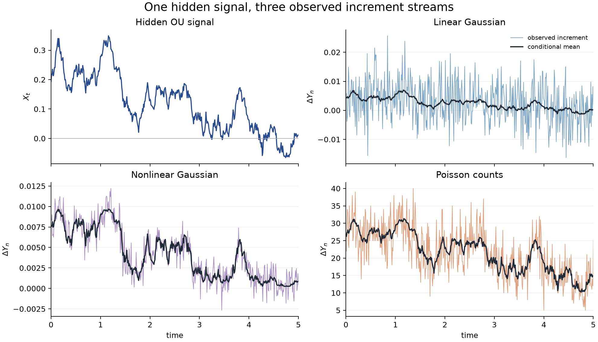
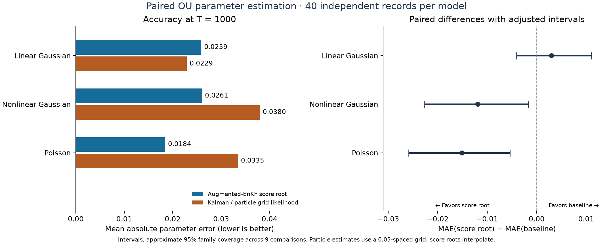

# likelihood_filtering

**Estimate a hidden system's mean-reversion rate from noisy measurements.** This
Python package studies a process whose state changes continuously but cannot be
observed directly. It filters the observations and estimates the unknown parameter
as data arrive.

The main examples share a one-dimensional Ornstein–Uhlenbeck (OU) signal:

$$
dX_t = -\theta X_t\,dt + \sigma\,dW_t.
$$

The signal diffusion amplitude is $\sigma=0.15$. Here, $X_t$ is the **hidden
signal** and $\theta$ controls how quickly it returns toward zero. The
estimator sees only one of these observation streams, not $X_t$:

| Observation model | What is recorded |
| --- | --- |
| Linear Gaussian | Noisy continuous measurements proportional to $X_t$ |
| Nonlinear Gaussian | Noisy continuous measurements through a sigmoid sensor |
| Poisson | Event counts whose rate depends on $X_t$ |



*What is observed:* The upper-left panel is one simulated hidden signal path.
The other panels show the corresponding observed increments $\Delta Y_n$
(discrete samples of $dY_t$) over a short window with $\Delta t=0.01$.
The dark curves are conditional mean increments given the hidden signal, shown
only to explain the observation models; the estimator receives the noisy
increments, not the signal or those means. Generate this illustration with
`python scripts/plot_readme_observations.py`.

**Input:** Gaussian observation increments or Poisson counts over time. **Output:**
a running estimate $\hat\theta_t$ of the mean-reversion rate, with score and
information diagnostics. The command-line experiments generate simulated data;
the Python filtering API also accepts supplied observation increments.


*Thesis numerical experiment:* Each panel shows 150 independently simulated
observation records for the same hidden OU model, with true parameter
$\theta_0=0.37$ and horizon $T=1000$. Pale blue lines are online estimates, the
black line is their median, and the red dashed line is the true value. The
estimates concentrate near $\theta_0$ as more observations arrive. These are
simulation results, reproduced from the numerical experiments chapter of the
author's PhD thesis. The original long-run artifacts are not committed here;
`configs/thesis.yaml` records their settings. The committed `reference/quick`
artifacts come from the much shorter smoke-test profile and do not reproduce
this figure.

## How the estimate is computed

1. For each candidate $\theta$ on a grid, run an **augmented ensemble Kalman
   filter**. Each ensemble member carries a possible hidden state together with
   the complete-data score and information.
2. Condition those quantities on the observations to approximate the **marginal
   likelihood score** for each candidate parameter.
3. Find where the score crosses zero, interpolate between neighboring grid
   points, and repeat as observations arrive to obtain $\hat\theta_t$.


*Thesis numerical experiment:* Each panel shows the estimated score across the
parameter grid at observation horizons of 250, 500, 750, and 1000 time units
for one representative observation record. The horizontal line is zero; its
crossing gives the score-root estimate. The dotted vertical line marks
$\theta_0=0.37$.

The package also includes a one-dimensional finite-element stochastic heat
equation with ten noisy spatial sensors. It is a small spatial proof of concept;
the OU examples above are the main demonstration. The single-filter
Louis/Newton estimator is available in `likelihood_filtering.experimental` as
a less robust research approximation.

## Comparison with likelihood-based estimators

The completed study uses **40 independent observation records per model**, with
$\theta_0=0.37$, $\Delta t=0.01$, and checkpoints $T=250,500,1000$. Each method
receives the same observations within a record. The primary endpoint is the
paired difference in mean absolute error (MAE) at $T=1000$; the earlier
checkpoints are secondary and are not additional independent replicates.
These results are separate from the thesis illustrations above.

| Observation model / baseline | Score-root MAE | Baseline MAE | Paired MAE difference | Adjusted interval |
| --- | ---: | ---: | ---: | --- |
| Linear Gaussian / Kalman likelihood | 0.0259 | 0.0229 | +0.0030 | [−0.0041, +0.0111] |
| Nonlinear Gaussian / particle likelihood | 0.0261 | 0.0380 | −0.0119 | [−0.0227, −0.0017] |
| Poisson / particle likelihood | 0.0184 | 0.0335 | −0.0151 | [−0.0259, −0.0054] |

Differences are score-root MAE minus baseline MAE, so negative values favor the
score root. Intervals use 50,000 paired-record bootstrap resamples and
Bonferroni-adjusted percentile levels, with **approximate 95% family coverage
across all nine model/checkpoint comparisons**. They describe uncertainty in
average performance across records, rather than uncertainty about a single
record's parameter.



At the final horizon, the score root has **31.4% lower MAE for nonlinear Gaussian
and 44.9% lower MAE for Poisson observations** than the implemented particle-grid
estimator; both adjusted intervals exclude zero. Kalman has lower point MAE in
the linear model, but the difference is unresolved by these 40 records. All
methods improve in MAE from $T=250$ to $T=1000$. All 360 reported score estimates
had a root, and no primary estimate reached a parameter bound.

**What is being compared.** Each method filters the available observation
prefix, without future observations or smoothing. The Kalman likelihood is
exact for the Euler-discretized linear Gaussian model; its optimization is
numerical. The particle likelihood integrates over hidden states by Monte Carlo.

| Method | State representation and parameter candidates | When parameter estimates are computed |
| --- | --- | --- |
| Augmented-EnKF score root | 19 fixed candidates, each with 75 augmented state/score/information members for linear Gaussian or 150 for the other models | Scores update at every observation; interpolated roots define a running estimate. This runner computes candidate paths in batches and evaluates the full root path. |
| Kalman likelihood | Scalar Gaussian mean and variance; no ensemble; continuous bounded parameter optimization | Optimize at each of the three checkpoints, refiltering the available prefix for each likelihood evaluation. |
| Bootstrap particle likelihood | 19 fixed candidates, each with 8,192 hidden-state particles; grid spacing 0.05 | State particles and cumulative likelihoods update at every observation; select the grid maximum at checkpoints. The same bank could return an estimate at every step without refiltering. |

The parameter banks are fixed grids, not learned parameter-posterior ensembles.
The nonlinear score bank contains 2,850 augmented members; the particle bank
contains 155,648 state particles. These members carry different quantities,
so their counts are not interchangeable measures of computational cost.
Median primary CPU seconds per record (score / baseline) are **184.4 / 1.22**
for linear Gaussian, **291.0 / 672.95** for nonlinear Gaussian, and
**288.7 / 601.78** for Poisson. These measure the workloads described above under
parallel execution, excluding simulation and sensitivity checks; they are not a
controlled latency comparison or an equal-budget study.

**Resolution and numerical sensitivity.** The particle grid's closest point to
0.37 is 0.35, imposing a minimum absolute error of **0.02**; the score root
interpolates. In a post hoc descriptive check, rounding score estimates to that
same grid gives MAEs of **0.0305 versus 0.0380** for nonlinear Gaussian and
**0.0275 versus 0.0335** for Poisson. This narrows the gaps and does not replace
an experiment with a finer particle grid. On the fixed five-record sensitivity
subset, changing filter seeds moves score estimates by up to 0.0412 and particle
estimates by up to 0.10; doubling particles moves estimates by up to 0.05.
The comparison therefore measures the tested finite implementations at one true
parameter, noise setting per model, and time step. It does not establish a
ranking of entire method families or numerical convergence.

The [full audited report](reference/comparison/analysis/report.md) includes RMSE,
bias, error trajectories, all sensitivity checks, and computational details.
The [study design and run commands](docs/comparison.md),
[resolved manifest](reference/comparison/manifest.json),
[per-record estimates](reference/comparison/estimates.csv),
[summary with all intervals](reference/comparison/summary.csv), and
[audit checksums](reference/comparison/analysis/audit.json) are included in the
repository. The [earlier 30-record study at $T=250$](docs/benchmark.md) is separate
and is not pooled with these results.

The baseline foundations are [Kalman (1960), linear filtering](https://people.math.harvard.edu/archive/116_fall_03/handouts/Kalman1960.pdf)
and [Gordon, Salmond & Smith (1993), the bootstrap particle filter](https://people.bordeaux.inria.fr/pierre.delmoral/gordon-salmond-smith-1993.pdf).
The implementations add likelihood maximization; the particle filter uses
adaptive systematic resampling. [Kantas et al. (2015)](https://arxiv.org/abs/1412.8695)
reviews the wider field of particle methods for parameter estimation, including
approaches beyond this benchmark.

## Install and run

Python 3.11 or newer is required. From the repository root:

```bash
python -m venv .venv
source .venv/bin/activate
python -m pip install -e .
```

Run the quick profile:

```bash
likelihood-filter run configs/quick.yaml --output runs/quick
```

This is a **smoke test**, with two replicates and a short horizon for each OU
case. Its plots are not performance evidence. The long-run settings corresponding
to the thesis examples are recorded separately and are substantially more
expensive:

```bash
likelihood-filter run configs/thesis.yaml --output runs/thesis --workers 4
```

`--workers` parallelizes independent Monte Carlo replicates only. Inspect the
approximate number of ensemble steps before running the full profile:

```bash
likelihood-filter run configs/thesis.yaml --output runs/thesis --dry-run
```

Each output directory contains a resolved `manifest.json` and `summary.csv`.
Individual case directories contain `metrics.csv`, compact `aggregates.npz`
files, figures, and compressed replicate artifacts on a reduced time grid.
Ensemble histories are not saved. The notebook in `notebooks/` reads these
artifacts without rerunning the filters.

## Model and implementation notes

For the scalar OU Gaussian cases, $\gamma$ denotes observation variance per
unit time. The configured Gaussian profiles evaluate the observation map at
the right endpoint of each step:

$$
dY_t=h(X_t)\,dt+\sqrt{\gamma}\,dV_t,
\qquad
\Delta Y_n=h(X_{t_{n+1}})\Delta t+\sqrt{\gamma\Delta t}\,Z_n.
$$

Configuration files use `observation_std` $=\sqrt{\gamma}$, so the variance
of an increment is $\gamma\Delta t$ or `observation_std**2 * dt`. The linear
and nonlinear OU profiles have `observation_std` values `0.068526` and
`0.0117758`, respectively; their corresponding $\gamma$ values are the
squares of those numbers. Ambiguous legacy names are rejected by the
configuration loader. A full covariance matrix can be supplied to
`GaussianObservation` through the Python API as `observation_covariance`.

For the heat equation, `state_noise_variance: 0.015` is the state-driving
variance; its amplitude is the square root of that value. This is separate
from observation noise.

The estimated parameter is scalar. The EnKF uses stochastic
perturbed-observation updates, and Poisson counts use a Gaussian ensemble
approximation. The Euler and finite-element discretizations are intended to
reproduce the thesis experiments. This is a focused inference package rather
than a general SDE or SPDE library. Custom finite-dimensional or spatial
signals can implement `ParametricSignal` with arrays shaped
`(ensemble, *state_shape)`.

The companion [SPDE_Poisson_filtering](https://github.com/jszala/SPDE_Poisson_filtering)
repository studies Poisson filtering for spatial models. This project follows
the same small-package, YAML-profile, and saved-artifact layout while keeping
its likelihood and score calculations independent.

Further details are in [the numerical methods](docs/numerical_methods.md), the
[thesis-to-code map](docs/thesis_to_code.md), and the
[reference output notes](reference/README.md).

## Development

```bash
python -m pip install -e '.[dev]'
ruff check .
ruff format --check .
pytest
python -m build
```

The source is released under the BSD 3-Clause license. Citation metadata is in
`CITATION.cff`.
