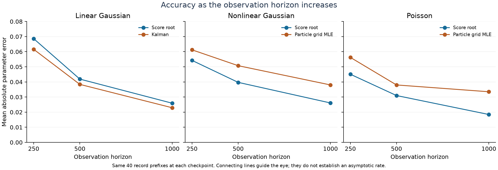

# Completed paired OU parameter-estimation comparison

Forty independent observation records per model, true parameter 0.37, Euler step 0.01, and checkpoints T=250, 500, 1000. Methods use identical observations within each record. The final horizon and paired MAE were the primary comparison; earlier checkpoints were secondary.

## Final accuracy

The interval columns use the planned Bonferroni-adjusted percentile bootstrap: 50,000 record resamples, approximate 95% family coverage over all nine model/checkpoint pairs. Negative differences favor the score root. Checkpoints are dependent observations from the same records; they are not extra independent replicates.

| Model / baseline | Score MAE | Baseline MAE | Paired MAE difference | Adjusted interval |
| --- | ---: | ---: | ---: | --- |
| Linear Gaussian / kalman | 0.0259 | 0.0229 | +0.0030 | [-0.0041, +0.0111] |
| Nonlinear Gaussian / particle | 0.0261 | 0.0380 | -0.0119 | [-0.0227, -0.0017] |
| Poisson / particle | 0.0184 | 0.0335 | -0.0151 | [-0.0259, -0.0054] |

The score root has lower MAE than the implemented particle-grid estimator in both nonlinear models at T=1000, with intervals excluding zero after adjustment. Its observed MAE is 31.4% lower for nonlinear Gaussian and 44.9% lower for Poisson observations. These percentages describe point estimates for the implemented configurations. Kalman has lower point MAE in the linear model; the interval includes zero, so the accuracy difference is unresolved by these 40 records. It does not demonstrate equivalence.

All methods improve in MAE between T=250 and T=1000. Only the two final nonlinear comparisons exclude zero under the adjustment across all nine comparisons. No primary estimate reached a parameter boundary, and all 360 score estimates at the reported checkpoints had a root. This does not assert root availability at every intermediate step.

| Model | RMSE score / baseline | Bias score / baseline |
| --- | ---: | ---: |
| Linear Gaussian | 0.0325 / 0.0281 | +0.0073 / +0.0011 |
| Nonlinear Gaussian | 0.0326 / 0.0439 | +0.0044 / +0.0075 |
| Poisson | 0.0247 / 0.0403 | +0.0071 / +0.0025 |

Poisson score-root bias is larger than the particle baseline's bias despite lower MAE and RMSE; its smaller spread improves the overall error. A ranking by bias alone would therefore tell a different and incomplete story.

## Numerical resolution and stability

The primary particle grid is spaced by 0.05 and its closest value to 0.37 is 0.35. Every primary particle estimate therefore has absolute error at least 0.02, even if its likelihood were evaluated perfectly. The score estimator interpolates, and the Kalman optimizer is continuous. This matters particularly for the Poisson score MAE of 0.0184, which is below that grid-imposed floor.

As an explicitly **post hoc descriptive diagnostic**, project each score estimate to the nearest point on the same primary particle grid. This requires no new filtering and changes only the score estimator's output resolution. It is not a replacement for the planned analysis.

| Model | Score MAE, original | Score MAE, projected to particle grid | Particle MAE |
| --- | ---: | ---: | ---: |
| Nonlinear Gaussian | 0.0261 | 0.0305 | 0.0380 |
| Poisson | 0.0184 | 0.0275 | 0.0335 |

The remaining descriptive gaps are 0.0075 and 0.0060. Projection shrinks the original gaps by approximately 37% and 60%, respectively. It does not isolate all numerical effects or establish what a continuously optimized particle likelihood would achieve.

The numerical checks use the fixed first five records per model and are not pooled with the primary 40. The table reports absolute changes in the parameter estimate at T=1000.

| Model | Method / check | Median change | Maximum change |
| --- | --- | ---: | ---: |
| Linear Gaussian | score_root / seed_repeat | 0.0162 | 0.0412 |
| Nonlinear Gaussian | score_root / seed_repeat | 0.0140 | 0.0302 |
| Nonlinear Gaussian | particle / seed_repeat | 0.0500 | 0.1000 |
| Nonlinear Gaussian | particle / particle_count | 0.0500 | 0.0500 |
| Nonlinear Gaussian | particle / grid_resolution | 0.0250 | 0.0250 |
| Poisson | score_root / seed_repeat | 0.0107 | 0.0172 |
| Poisson | particle / seed_repeat | 0.0000 | 0.0500 |
| Poisson | particle / particle_count | 0.0500 | 0.0500 |
| Poisson | particle / grid_resolution | 0.0250 | 0.0250 |

Particle-seed changes reach 0.10 for nonlinear Gaussian and 0.05 for Poisson; doubling particles changes estimates by up to 0.05 in each. The finer 37-point grid changes estimates by up to 0.025. EnKF-seed changes are also material: maxima 0.0412, 0.0302, and 0.0172 for linear Gaussian, nonlinear Gaussian, and Poisson. Five paired checks cannot estimate numerical convergence or decompose error reliably. These changes are comparable to, or larger than, the mean accuracy gaps, so claims concern the tested randomized implementations rather than infinite-ensemble estimators.

## Update schedule, resources, and computation

| Method | State representation | Parameter treatment and update schedule |
| --- | --- | --- |
| Score root | 75 augmented members per candidate for linear Gaussian, 150 for other models | 19 fixed candidates; score updates at every observation; interpolated roots define a running estimate. The runner computes candidate paths in batches and evaluates the full root continuation. |
| Kalman likelihood | Gaussian mean and variance, no state ensemble | Continuous bounded parameter optimization at each checkpoint; each likelihood evaluation refilters the available prefix. |
| Particle likelihood | 8,192 hidden-state particles per candidate | 19 fixed candidates; update cumulative likelihood and state particles at every observation, take the grid maximum at checkpoints. The bank could return a grid maximum every step without refiltering. |

Fixed parameter banks are not learned parameter-posterior ensembles. The particle bank contains 155,648 hidden-state particles; the nonlinear score bank has 2,850 augmented ensemble members. Their members carry different quantities, so these are counts, not equivalent units of memory or computation. All methods use filtering information only, with no future observations or smoothing.

| Model | Median primary CPU seconds: score | Median primary CPU seconds: baseline |
| --- | ---: | ---: |
| Linear Gaussian | 184.4 | 1.22 |
| Nonlinear Gaussian | 291.0 | 672.95 |
| Poisson | 288.7 | 601.78 |

For these implementations, Kalman uses about 151 times less CPU than the score-root workload in the linear model. The score-root workload uses about 2.31 and 2.08 times less CPU than the particle workloads in the two nonlinear models. Costs exclude data simulation, artifact writing, and numerical checks. They include the full running root path, three Kalman prefix optimizations, or one cumulative particle likelihood bank. Timing came from parallel launches with varying load; these are workload measurements, not a controlled latency benchmark or equal-budget optimization study.

## Interpretation

The score-root method demonstrates accurate running parameter estimation in these partially observed models. At the final horizon it combines lower error and lower measured computation than the tested particle-grid likelihood implementation. The exact linear-Gaussian likelihood remains the practical reference when its assumptions hold. The nonlinear results identify a useful accuracy/computation tradeoff for the implemented settings; resolution and seed sensitivity prevent a broader claim of superiority over particle-based parameter inference.

The 40-record bootstrap quantifies sampling variation for these randomized algorithms under the simulated model. It does not remove grid bias, EnKF approximation error, or particle likelihood error, and it is not a confidence interval for a single record's parameter. One true parameter, one noise setting per model, and one Euler step are evaluated. The three horizons do not establish an asymptotic rate. Algorithmic improvements should be evaluated on fresh records with a declared computational budget.

## Method references

- Kalman, R. E. (1960), *A New Approach to Linear Filtering and Prediction Problems*. [Original paper](https://people.math.harvard.edu/archive/116_fall_03/handouts/Kalman1960.pdf). This is the state-filter foundation; the implemented estimator adds innovation-likelihood optimization.
- Gordon, N. J., Salmond, D. J., and Smith, A. F. M. (1993), *Novel approach to nonlinear/non-Gaussian Bayesian state estimation*. [Original bootstrap-filter paper](https://people.bordeaux.inria.fr/pierre.delmoral/gordon-salmond-smith-1993.pdf). The implementation uses adaptive systematic resampling and maximizes its likelihood estimate on a grid.
- Kantas et al. (2015), *On Particle Methods for Parameter Estimation in State-Space Models*. [Review](https://arxiv.org/abs/1412.8695). Places particle likelihood estimation and static-parameter inference in their wider methodological context.
- Evensen (2003), *The Ensemble Kalman Filter: theoretical formulation and practical implementation*. [Author paper via ECMWF](https://www.ecmwf.int/sites/default/files/elibrary/2003/74424-ensemble-kalman-filter-theoretical-formulation-and-practical-implementation_0.pdf). Ensemble-filter background, rather than a source for this thesis's score-root construction.
- Chopin, Jacob, and Papaspiliopoulos, *SMC²: an efficient algorithm for sequential analysis of state-space models*. [Paper](https://arxiv.org/abs/1101.1528). An unbenchmarked sequential Bayesian alternative with parameter particles and nested state filters; its posterior target differs from this point-estimation study.

## Audit and regeneration

Verified 120 record files, 855 estimate rows, 285 cost rows, and 18 summary rows. The audit checks complete planned variants, pairing checksums, finite estimates, saved particle maxima and score roots, every accuracy metric, and all bootstrap intervals. The original run artifacts remain unchanged. Input hashes are in `audit.json`.

```bash
python scripts/analyze_comparison.py --input reference/comparison
```



